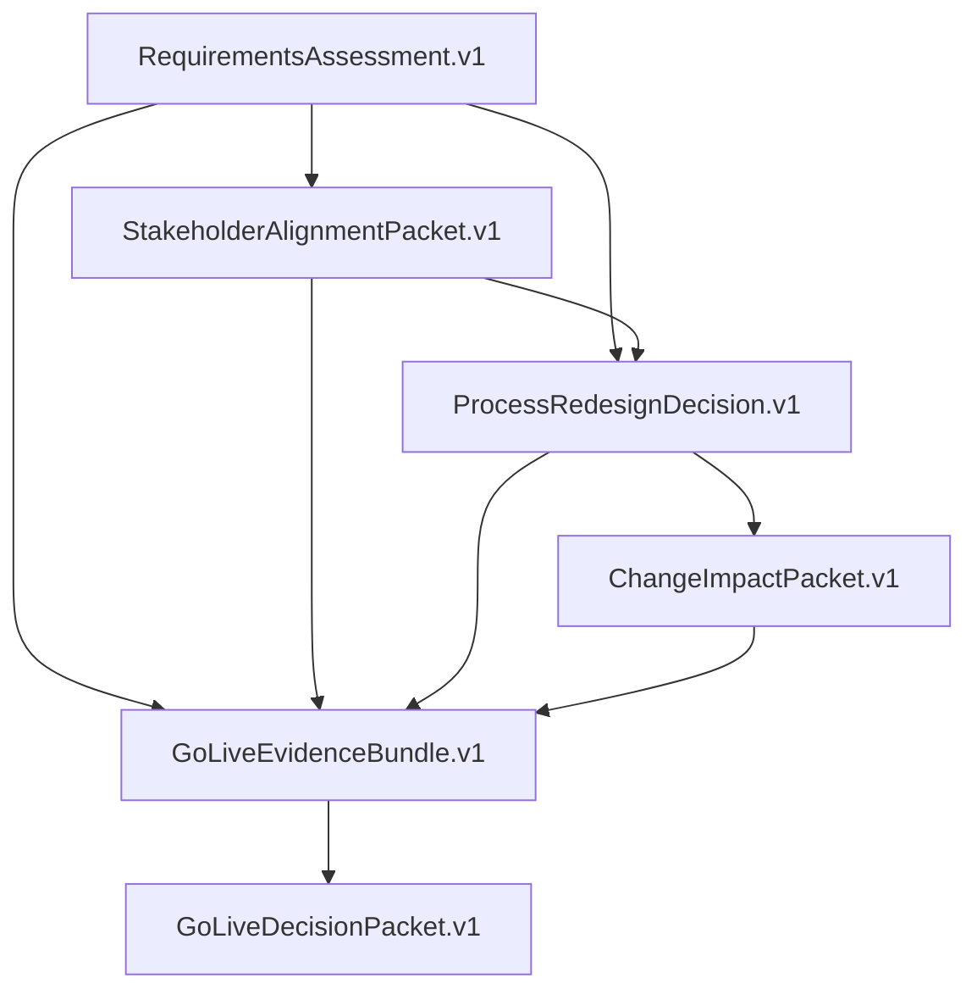

# Transformation Portfolio Contracts

[](https://github.com/DameurMounir/transformation-portfolio-contracts/actions/workflows/ci.yml)
[](LICENSE)
[](pyproject.toml)

> **Repository identity control:** G0 records a proposed transition to
> `transformation-agent-contracts`. No repository setting, release, package name, schema identifier,
> or consumer reference is changed by the migration-manifest branch. See the
> [current status](docs/status/current.md) and
> [identity manifest](docs/migration/identity-manifest.md).

`transformation-portfolio-contracts` is the provider-neutral interoperability specification for a
five-stage business-transformation portfolio. It defines immutable, schema-validated,
digest-bound artifacts that independent repositories can produce and consume without importing
one another's internal code or sharing an operational database.

This is a contract layer, not a sixth analytical agent. It carries evidence, lineage, lifecycle,
risk, and human-authority records; it does not make or override business decisions.

## Portfolio architecture



Each arrow represents a content-addressed artifact reference. A consumer validates the schema,
contract compatibility, transformation and candidate identity, lifecycle state, producer metadata,
payload digest, lineage digest, chronology, and human authority required for its stage. A failure in
any required check blocks consumption.

## Contract catalog

| Contract | Producer | Principal consumer |
| --- | --- | --- |
| `RequirementsAssessment.v1` | `requirements-quality-agent` | Stakeholder alignment and later stages |
| `StakeholderAlignmentPacket.v1` | `stakeholder-alignment-agent` | Process redesign and go-live assembly |
| `ProcessRedesignDecision.v1` | `process-redesign-agent` | Business change impact |
| `ChangeImpactPacket.v1` | `business-change-impact-agent` | Go-live assembly |
| `GoLiveEvidenceBundle.v1` | Evidence-bundle assembler | Go-live decision |
| `GoLiveDecisionPacket.v1` | `go-live-decision-agent` | Human release authority and audit |

Common contracts include `ArtifactEnvelope.v1`, `EvidenceReference.v1`, `Finding.v1`,
`HumanDecision.v1`, `RiskEnvelope.v1`, and `AgentEvent.v1`. All schemas use JSON Schema Draft
2020-12. The machine-readable source of truth is [`registry/contract-catalog.json`](registry/contract-catalog.json).

## Quick start

```bash
git clone --branch v1.0.0 --depth 1 \
  https://github.com/DameurMounir/transformation-portfolio-contracts.git
cd transformation-portfolio-contracts
python3 -m venv .venv
. .venv/bin/activate
python -m pip install 'pip>=26.1.2,<27'
python -m pip install 'setuptools>=83,<84' 'wheel>=0.45,<1'
python -m pip install -e '.[dev]'
portfolio-contracts verify-conformance --json
portfolio-contracts verify-example --json
```

Validate a portable artifact and print its canonical digest:

```bash
portfolio-contracts validate \
  --contract RequirementsAssessment.v1 \
  --artifact examples/atlasbridge-end-to-end/01-requirements-assessment.v1.json

portfolio-contracts digest \
  examples/atlasbridge-end-to-end/01-requirements-assessment.v1.json
```

Validate an ordered artifact chain:

```bash
portfolio-contracts verify-lineage \
  examples/atlasbridge-end-to-end/01-requirements-assessment.v1.json \
  examples/atlasbridge-end-to-end/02-stakeholder-alignment-packet.v1.json \
  examples/atlasbridge-end-to-end/03-process-redesign-decision.v1.json \
  examples/atlasbridge-end-to-end/04-change-impact-packet.v1.json \
  examples/atlasbridge-end-to-end/05-go-live-evidence-bundle.v1.json \
  examples/atlasbridge-end-to-end/06-go-live-decision-packet.v1.json
```

Verify an ordered tamper-evident AgentEvent chain supplied as event files, a directory, or an
`{"events": [...]}` scenario:

```bash
portfolio-contracts verify-events path/to/ordered-event-scenario.json --json
```

The CLI returns non-zero for invalid input: `2` for usage, `3` for unavailable input or resources,
`4` for artifact contract validation, `5` for lineage or AgentEvent-chain validation, `6` for
conformance/example validation, and `70` for an internal or dependency failure. Automation must
treat every non-zero value as a hard stop.

## Integrity profile

Artifacts are canonicalized with RFC 8785 JSON Canonicalization Scheme and digested with SHA-256.
Digests use explicit projections and domain separation; validators never hash a JSON document that
contains the digest value being verified. Full details and test vectors are in
[`docs/digest-profile.md`](docs/digest-profile.md).

An `AgentEvent.v1` uses the same JCS and SHA-256 primitives. Its `event_digest` covers every event
member except only the top-level `event_digest` itself, including `previous_event_digest`. Event
verification additionally requires one ordered, single-root, fork-free chain with consistent
transformation and correlation identity, forward chronology, and earlier-event causation.

The contract family rejects, among other cases:

- a changed byte that alters canonical content;
- an unsupported contract major version;
- a missing upstream artifact or human decision;
- mismatched transformation or release-candidate identity;
- `DRAFT`, `REJECTED`, or `SUPERSEDED` required inputs;
- malformed or conflicting producer provenance;
- duplicate artifact IDs with different content;
- downstream-before-upstream chronology;
- stale references and lineage cycles.

Passing validation means that an artifact satisfies this specification. It does not mean the
underlying evidence is true, the decision is approved, or a deployment is authorized.

## Repository layout

```text
schemas/       Normative Draft 2020-12 contracts
registry/      Contract catalog, compatibility, and producer-consumer rules
conformance/   Valid and invalid fixtures with expected outcomes
examples/      Synthetic AtlasBridge end-to-end chain
src/           Canonicalization, validation, lineage, and CLI implementation
tests/         Unit, negative, determinism, and conformance tests
docs/          Architecture, governance, digest profile, and adoption guide
```

## Integration boundary

Stage repositories remain independently runnable and independently released. A governed run pins
their release tags and commit SHAs, exchanges files through public contracts, and treats upstream
artifacts as immutable. The integration layer must not:

- import private classes from another stage repository;
- rewrite, enrich, or silently normalize an upstream decision;
- fetch floating branches in a certified run;
- share one mutable operational database;
- collapse stage-specific states into one ambiguous global status;
- grant a coordinating process authority over human decisions.

Start with the [adoption guide](docs/adoption-guide.md). Architecture and ownership boundaries are
in [architecture](docs/architecture.md), and contract evolution rules are in
[governance](docs/governance.md).

## Guarded VPS transaction

The repository includes one bounded installer that verifies an existing source directory or a
SHA-256-pinned tarball. Its default is verification only:

```bash
SOURCE_DIR=/absolute/path/transformation-portfolio-contracts \
EVIDENCE_ROOT=/absolute/path/artifacts/transformation-portfolio-contracts/v1.0.0 \
bash build_and_publish_transformation_portfolio_contracts_v1.0.0.sh
```

Tarball mode additionally requires `SOURCE_TARBALL_SHA256` and an absent `TARGET_DIR`; the script
never merges into or replaces an existing directory. It runs lint, format, strict typing, tests,
conformance, security checks, two reproducibility builds, package metadata validation, and an
installed-wheel resource smoke test. Once input initialization succeeds, evidence is preserved even
on failure.

Git commit, annotated tag, public repository creation, and normal pushes remain unreachable unless
`PUBLISH=1`. Publication also requires an exact `EXPECTED_REMOTE_MAIN` (`EMPTY` for the first push or
the current 40-character commit), authenticated GitHub CLI, configured Git identity, the exact
`DameurMounir/transformation-portfolio-contracts` public repository, and `CREATE_REMOTE=1` when the
repository does not yet exist. The script contains no force, reset, rebase, cleanup, or deletion
path.

When publication succeeds, the installer records
`SOURCE_TAG_PUBLISHED_RELEASE_PENDING`: it has verified the exact remote `main` and tag refs, but it
has not certified a GitHub release. The release workflow must subsequently pass and its wheel,
source archive, `SHA256SUMS`, provenance attestation, and repository protection state must be
verified independently. When both refs are absent, the installer publishes `main` and the tag in
one atomic push; an idempotent single-ref push is allowed only after the other exact ref is proven.

## Development and release

```bash
make install-dev
make check
```

CI runs Python 3.11, 3.12, and 3.13. A `vX.Y.Z` release tag is accepted only when it matches the
package version, points to `main`, passes all gates, produces valid wheel and source archives, and
does not overwrite an existing GitHub release. Releases publish `SHA256SUMS` and GitHub build
provenance. Build isolation requires the audited setuptools 83.x line; versions through 82.0.1 are
rejected because their source-distribution manifest exclusions are vulnerable to Unicode
normalization bypass.

An installer source/tag result is not a release result; only the completed workflow and the
published, independently verified GitHub assets can satisfy the release gates above.

See [CONTRIBUTING.md](CONTRIBUTING.md), [SECURITY.md](SECURITY.md), and [CHANGELOG.md](CHANGELOG.md).

## License

Apache License 2.0. See [LICENSE](LICENSE).
