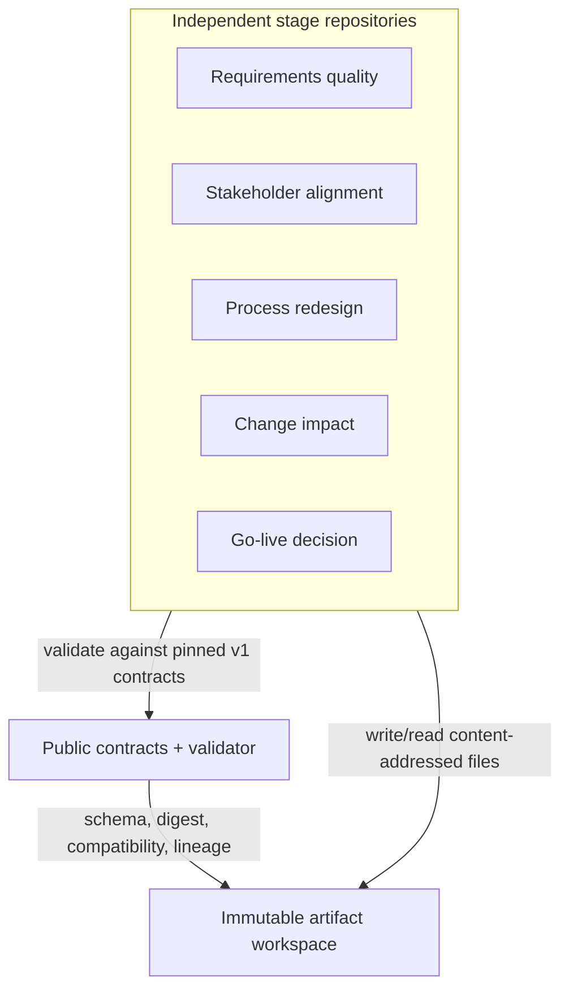
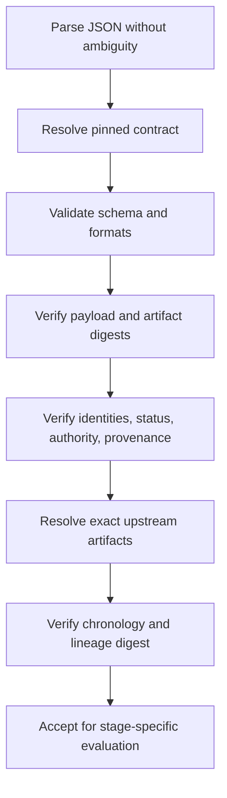

# Architecture

## Purpose

The contract layer turns five independently released analytical projects into an interoperable
decision system. It standardizes what crosses a repository boundary while leaving domain reasoning,
storage, user experience, and release authority inside the owning stage.

The unit of integration is an immutable artifact, not a Python object, database row, or README link.

## System context

The contracts repository has no privileged connection to a stage repository. The same schemas and
validator can be vendored, installed from a release, or invoked as a CLI. The artifacts remain
portable JSON.

## Artifact topology

| Stage | Consumes | Produces |
| --- | --- | --- |
| Requirements quality | Original requirement evidence | `RequirementsAssessment.v1` |
| Stakeholder alignment | Requirements assessment and stakeholder evidence | `StakeholderAlignmentPacket.v1` |
| Process redesign | Requirements, alignment, and AS-IS process evidence | `ProcessRedesignDecision.v1` |
| Business change impact | Confirmed process-redesign decision and business graph | `ChangeImpactPacket.v1` |
| Evidence assembly | Four upstream artifacts and operational evidence | `GoLiveEvidenceBundle.v1` |
| Go-live decision | Evidence bundle and pinned policy | `GoLiveDecisionPacket.v1` |

`GoLiveEvidenceBundle.v1` references the four upstream packets. It does not flatten or reinterpret
their decisions. Operational evidence may be embedded or referenced as the bundle schema permits,
but every referenced item retains its source identity and digest.

## Contract layers

The public surface has four layers:

1. **Common contracts** define the envelope and portable evidence, finding, decision, risk, and
   event concepts.
2. **Stage contracts** define the business payload and mandatory relationships for each transition.
3. **Registries** define discoverability, supported versions, producer-consumer compatibility, and
   expected relationships.
4. **Executable conformance** canonicalizes JSON, verifies digests and lineage, and runs positive and
   negative fixtures.

JSON Schema handles structural and local semantic constraints. Python validation handles invariants
that cross documents or require computation, including digest equality, chronological ordering,
identity consistency, duplicate-ID conflicts, and graph cycles.

## Envelope and payload

The common artifact envelope carries:

- stable artifact, transformation, and case identity;
- contract and lifecycle versions;
- stage and status;
- producer repository, release, commit, tree, and tool version;
- immutable upstream references and their relationships;
- scoped human authority when required;
- limitations and supersession information;
- payload, payload digest, artifact digest, and full-chain digest.

The payload remains stage-specific. A common envelope makes routing and governance portable without
erasing the richer semantics of the producing project.

## Validation sequence

A consumer performs these checks in order and stops at the first invalid boundary:

No later check may convert an earlier failure into a warning. Schema validity alone never implies
that the artifact is authorized or its evidence is true.

## Identity model

`transformation_id` is the portfolio-wide correlation key. `case_id` identifies the business case,
and stage-local artifact IDs remain stable within that transformation. The AtlasBridge reference
case uses:

| Identity | Canonical value |
| --- | --- |
| Transformation | `ATLASBRIDGE-ONBOARDING-TRANSFORMATION-001` |
| Requirements baseline | `ATLASBRIDGE-REQ-001` |
| Alignment decision | `ATLASBRIDGE-ALIGN-001` |
| Process decision | `ATLASBRIDGE-PROCESS-001` |
| Change package | `ATLASBRIDGE-CHANGE-001` |
| Release candidate | `ATLASBRIDGE-ONBOARDING-2` |

Existing v0.1.0 stage histories are not rewritten. Stage adapters map their local identifiers to
canonical portfolio identifiers and preserve the relationship explicitly.

## Human authority boundary

The contract layer records an authority decision; it does not create that authority. A required
decision must identify the actor, role, authority scope, action, outcome, rationale or conditions,
artifact digest, and recorded time. Validators verify presence, shape, scope compatibility, and
digest binding. They cannot determine whether an organization lawfully appointed the actor; that
remains producer and consumer governance evidence.

A go-live result is decision support. Only the named external authority may authorize a release.

## Event and lineage model

Artifacts form a directed acyclic graph through exact input references. Events form an independent
append-only audit chain through `previous_event_digest`. These structures correlate through stable
transformation, artifact, correlation, and causation identifiers without requiring one database.

Each AgentEvent digest covers the complete event except its own top-level `event_digest`, so it also
binds the predecessor digest. A valid requested chain has one null-predecessor root, no duplicate
identity or digest, no fork, cycle, stale predecessor, or disconnected node, and arrives in exact
root-to-terminal order. Transformation and correlation identities remain constant; causation names
an earlier event, event time is nondecreasing, and any artifact reference belongs to the same
transformation.

Changing canonical content changes its artifact digest. Every descendant embeds the expected
upstream artifact and chain digests, so the mismatch propagates and prevents a stale chain from
validating. The exact algorithm is specified in [digest-profile.md](digest-profile.md).

## Trust boundaries and threats

| Threat | Required response |
| --- | --- |
| Upstream byte or semantic change | Artifact or payload digest mismatch; reject |
| Artifact ID reused for different content | Conflict; reject every ambiguous occurrence |
| Wrong transformation or candidate | Identity mismatch; reject |
| Unsupported major contract | Compatibility failure; reject |
| Missing or out-of-scope human decision | Authority failure; reject |
| Stale or superseded input | Lifecycle failure; reject |
| Downstream created before upstream | Chronology failure; reject |
| Cyclic lineage | Graph failure; reject |
| Reordered, forked, stale, or tampered event chain | AgentEvent-chain failure; reject |
| Forged producer metadata | Schema may pass; provenance verification remains required |
| False source evidence with valid digest | Outside content-integrity proof; independent evidence review required |

SHA-256 detects content mismatch; it is not an identity signature. Governed use therefore pins
releases and commit SHAs and verifies published checksums and build provenance.

## Explicit non-goals

This repository does not:

- host an orchestration service or shared control plane;
- provide an operational data store, message broker, or identity provider;
- call a stage engine or import its private package;
- select a process option, accept risk, or grant go-live authority;
- duplicate all upstream content into every downstream payload;
- define organization-specific retention, privacy, or access policy;
- make a floating branch suitable for a certified run.

These boundaries keep each stage independently testable and releasable while making the complete
lineage objectively verifiable.
